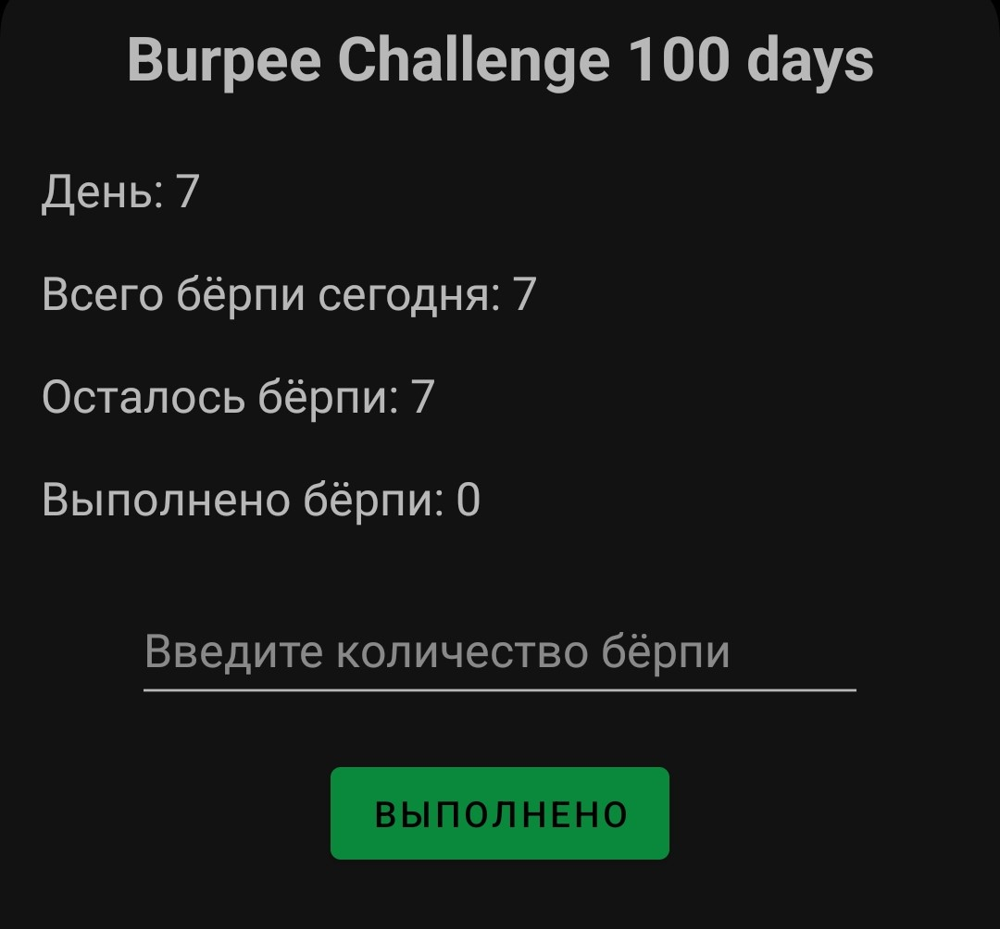

# Burpee Challenge 100 Days

[](https://github.com/italian/Burpee-Challenge-100-Days)

Burpee Challenge 100 Days - это Android приложение, которое помогает пользователям отслеживать выполнение заданного количества берпи в день в рамках челленджа на 100 дней.

## Описание
Приложение рассчитано на 100-дневный челлендж, начиная с одного берпи в день и увеличивая количество на один каждый день.
В случае пропуска дня, необходимо выполнить количество берпи за пропущенный день на следующий день.
Если не выполнить необходимое количество берпи в день, то на следующий день потребуется сделать столько же, сколько было нужно в предыдущий день.
Это увеличивает общую продолжительность челленджа.

## Основные функции
- Отслеживание текущего дня челленджа.
- Отображение общего количества берпи на текущий день.
- Ввод количества выполненных берпи.
- Автоматическое обновление статистики выполнения.

## Скриншоты


## Установка и запуск
1. Клонируйте репозиторий:
    ```sh
    git clone https://github.com/italian/Burpee-Challenge-100-Days.git
    ```
2. Откройте проект в Android Studio.
3. Соберите и запустите приложение на вашем устройстве или эмуляторе.

## Использование
1. Запустите приложение.
2. Следуйте указаниям на экране для отслеживания прогресса выполнения челленджа.

## Планируемые функции

В будущем планируется добавить следующие функции:

1. **Инструкции и видеоуроки**:
   - Добавить текстовые инструкции и ссылки на видеоуроки по выполнению берпи.

2. **Статистика выполнения**:
   - Добавить на экран информацию о том, сколько всего берпи осталось выполнить и сколько уже выполнено за весь челлендж.

3. **Уведомления**:
   - Добавить возможность настройки уведомлений для напоминаний о выполнении упражнений.

4. **Улучшение дизайна**:
   - Обновить и улучшить пользовательский интерфейс для более приятного взаимодействия.

5. **Награды**:
   - Ввести систему наград за каждые 10 выполненных дней, чтобы мотивировать пользователей.

6. **Локализация**:
   - Добавить английскую локализацию, чтобы расширить аудиторию пользователей.

7. **Социальные сети**:
   - Ввести возможность поделиться наградами в социальных сетях.

8. **Приглашение друзей**:
   - Добавить функцию приглашения друзей с возможностью отслеживать их прогресс.

## Лицензия
Этот проект лицензирован под AGPL-3.0 License. Подробности см. в файле [LICENSE](LICENSE).

## Контакты
Если у вас есть вопросы или предложения, пожалуйста, свяжитесь со мной.
